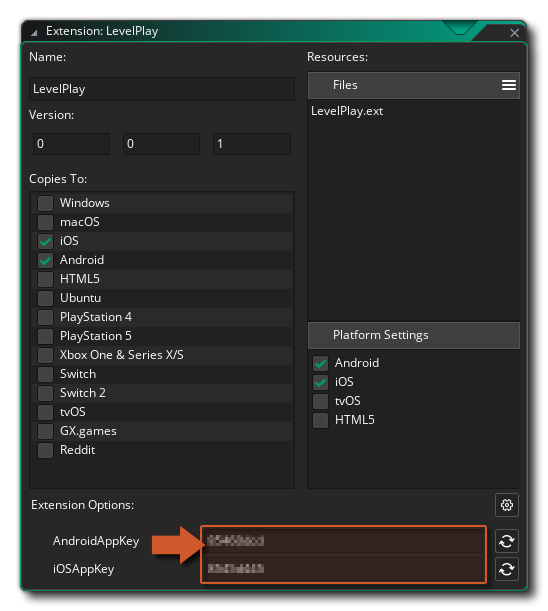

@title Extension Options

You can access the Extension Options by navigating to the **GMLevelPlay** extension asset in the [Asset Browser](https://manual.gamemaker.io/monthly/en/Introduction/The_Asset_Browser.htm) and double-clicking it.

## Options

### AndroidAppKey

| | |
|---|---|
| **Type** | String |
| **Required** | Yes, if targeting Android |
| **Platform** | Android only |

The App Key for your app, used to initialise the LevelPlay SDK on Android. Found on the Unity LevelPlay (ironSource) dashboard under your app's Android platform settings.

[[Important: Without a valid `AndroidAppKey`, ${function.levelplay_init} will fail to initialise the SDK on Android.]]

### iOSAppKey

| | |
|---|---|
| **Type** | String |
| **Required** | Yes, if targeting iOS |
| **Platform** | iOS only |

The App Key for your app, used to initialise the LevelPlay SDK on iOS. Found on the Unity LevelPlay (ironSource) dashboard under your app's iOS platform settings.

[[Important: Without a valid `iOSAppKey`, ${function.levelplay_init} will fail to initialise the SDK on iOS.]]

## Mediation network options

Most `LevelPlay_<Network>` mediation extensions have no configurable options - enabling the extension is
enough. The Google mediation extension is the one exception, requiring its own App ID:

### LevelPlay_Google: Android_AppID

| | |
|---|---|
| **Type** | String |
| **Required** | Yes, if the `LevelPlay_Google` extension is enabled for Android |
| **Platform** | Android only |

Your AdMob Application ID for Android, in the form `ca-app-pub-XXXXXXXXXXXXXXXX~YYYYYYYYYY`. Found on
the AdMob dashboard under **App settings**. Injected into the Android manifest's
`com.google.android.gms.ads.APPLICATION_ID` meta-data entry.

[[Important: The Google mediation adapter's manifest merge fails at build time without a valid
`Android_AppID` when `LevelPlay_Google` is enabled for Android.]]

### LevelPlay_Google: iOS_AppID

| | |
|---|---|
| **Type** | String |
| **Required** | Yes, if the `LevelPlay_Google` extension is enabled for iOS |
| **Platform** | iOS only |

Your AdMob Application ID for iOS, in the form `ca-app-pub-XXXXXXXXXXXXXXXX~YYYYYYYYYY`. Found on the
AdMob dashboard under **App settings**. Injected into the compiled `Info.plist`'s
`GADApplicationIdentifier` key.

[[Important: Google's Mobile Ads SDK crashes on the first ad request without a valid `iOS_AppID` when
`LevelPlay_Google` is enabled for iOS.]]
